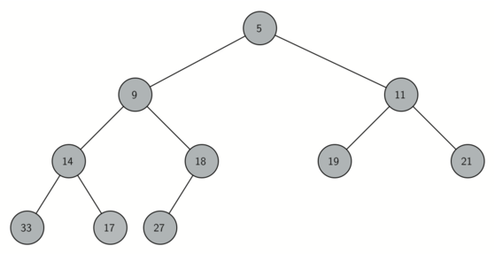

# Variation of FIFO (Queue) - Priority Queue

Acts like a queue in that **you dequeue an item by removing it from the front**, however in a priority queue
**the logical order of items inside a queue is determined by the priority.**

When you enqueue an item on a priority queue, the new item may move all the way to the front. It is useful
data structure for some of the graph algorithms we will study in the next chapter.

You can probably think of a couple of easy ways to implement a priority queue using sorting functions and lists.
**A classic way to implement a priority queue is to use a binary heap.** Enque and Dequeue item takes **O(log(n))**

It is interesting to study because when we diagram the heap it looks a lot like a tree, but when we implement it
we use only a single list as an internal representation. Variation: 
    **min heap:** smallest value is always at the front
    **max heap:** largest value is always at the front

# Binary Heap Operations
    
The basic operations we will implement for our binary heap are as follows:
    **BinaryHeap()**: creates a new empty binary heap
    **insert(k)**: adds a new item to the heap
    **get_min()**: returns the new item with the minimum key value, leaving the item in the heap
    **delete()**: returns the item with the minimum key value, removing the item from the heap
    **is_empty()**: returns True if the heap is empty. False otherwise.
    **size()**: returns the number of items in the heap
    **heapify(list)**: builds a new heap from the list of keys

# Binary Heap Implementation

## The Structure Property

In order to make our heap work efficiently, we will take advantage of the logarithmic nature of the
binary tree to represent our heap. In order to guarantee logarithmic performance, we must keep our tree
balanced. A balanced binary tree has roughly the same number of nodes in the left and right subtrees of the
root.

In our heap implementation, we keep the tree balanced by creating a **complete binary tree**.

A complete binary tree is a tree in which each level has all of its nodes. The exception to this is the bottom
level of the tree, which we fill in from left to right. 

**interesting property**: we only need a single list and do not need to use nodes and references or even a list of lists.
    - the left child of a parent (at position p) is the node found in position 2p + 1. Similarly the right child of a parent
      is the node found in position 2p + 2 in the list.
    - given a node that is in position n in the list, the parent is (n-1)//2